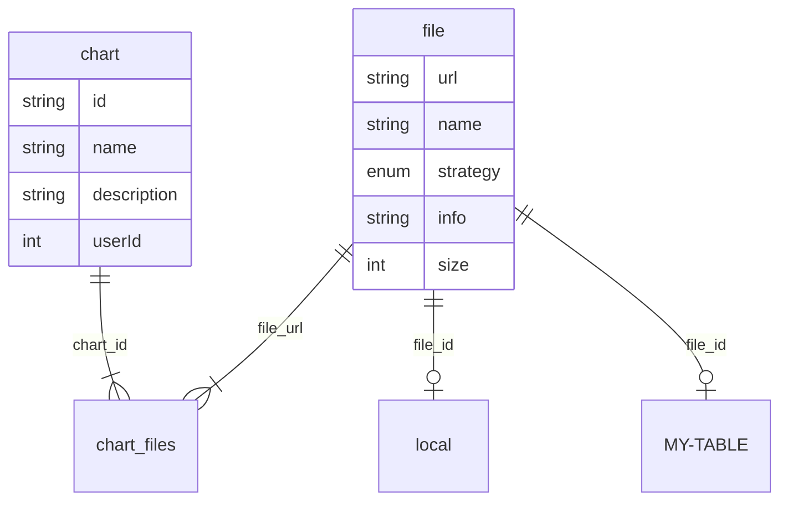

## Description

### Design

The focus of this module is to serve static files. So, user, page related should not include here.

Here we should save chart's name, description, file's path or table path for rendering.

But I notice in v3-v4 contains shared files. So, we should extract file into another table,
and do a many-to-many mapping.

### Behaviour

- **chart**:
	- should include chart required data

- **file**:
	- should include file required data

- **storage(local/MY-TABLE)**
	- should include file 

## Testing

