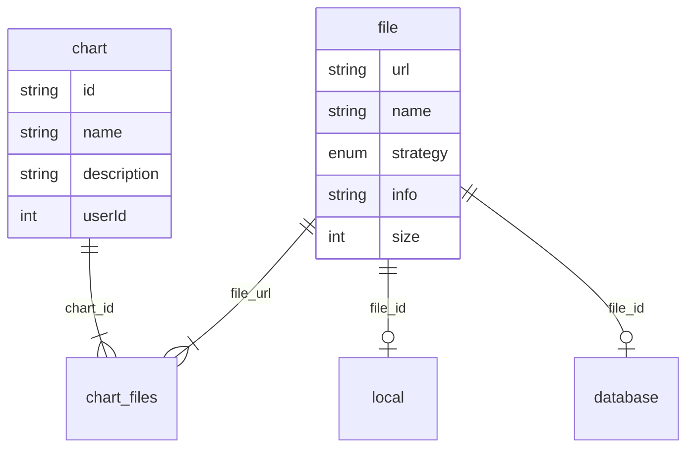

## Description

### Design

---

The focus of this module is to serve static files. So, user, page related should not include here.

Here we should save chart's name, description, file's path or table path for rendering.

But I notice in v3-v4 contains shared files. So, we should extract file into another table,
and do a many-to-many mapping.

### Behaviour

---

#### Storage(local/database) module

In the storage module, we should handle both local storage and database storage.

- **Handles**:

	- **_saveStorage_**: Save a storage and use models hooks for trigger IO and database handling.
		In IO handling, we will move exist file path to correct place(the path generate from chartId).

	- **_getStorage_**: Get a storage based on File model. Get both local and database storage.(we
		can create/get both local and database here).

	- **_updateStorage_**: Update a storage.
		In IO handling, replace correct path with new file;
		In database handling, calculate difference with different operation (Simple implement: drop
		old database and create new database).

	- **_deleteStorage_**: Remove a storage based on File model.
		Due to one-to-one relationship, this function have to remove this table because of cascade(In
		the further study, cascade not able to trigger model hooks. So, Here replace cascade by set
		null).

#### File module

In the file module we should handle file info and both local storage and database storage.
It designs like an extender for storage, which has a one-to-one relationship.

- **Handles**:

	- **_saveFile_**: Alias for **_saveStorage_**.

	- **_getFileByUrl_**: Alias for **_getStorage_**.

	- **_updateFile_**: In update file handle, we should distinguish different strategy:
		
		- update the strategy -> remove old storage, and create new storage
		- same strategy -> use alias for **_updateStorage_**.

	- **_deleteFile_**: Alias for **_deleteStorage_**.

#### Chart module

In the chart module we should handle file and chart tables. However, we have to face a problem that
multiple chart use a single file. So a many-to-many relationship should be use.

- **Handles**:

	- **_saveChart_**: We should insert both chart and file data into tables, if file have been created,
		we have to check did file exists before insert action;

	- **_getChartById_**: Chart should be found in this function with file data, which means we have to
  	inner join all of ChartFile -> File -> Local/Database -> Database Linked file(optional).

	- **_updateChart_**: In this function, we can create 

### Testing

#### file Module

#### Chart module

**_saveChart test_**

| Test Content   | Result  | input | Status |
|----------------|---------|-------|--------|
| saveChart test |         |       |        |
|                |         |       |        |
|                |         |       |        |
|                |         |       |        |
|                |         |       |        |

