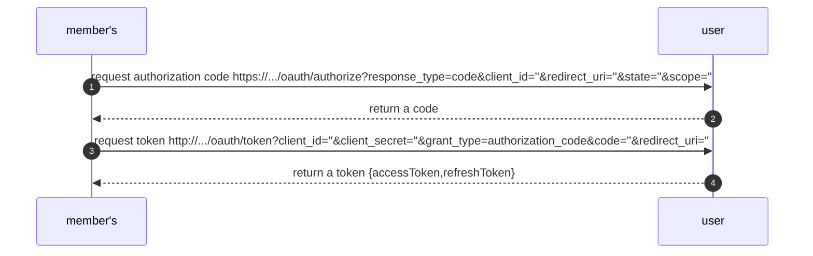
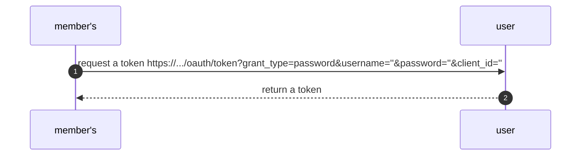

OAuth2.0 understanding

grant type we are going to use:

1. authorization code grant:

2. password grant:

But we could share our data with password grant model

- user model

## Test page

### Development

start npm script: `npm start:user`

visit address: http://localhost:3000/? + settings

### Production

start npm script: `npm start`

visit address: http://localhost:3000/api/user? + settings
