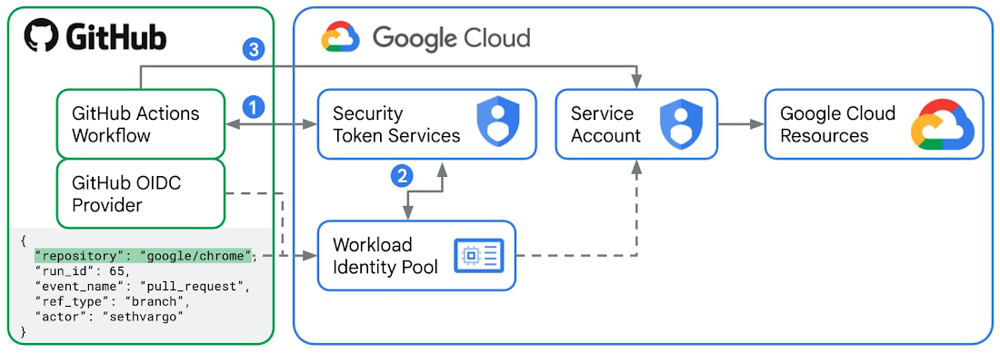
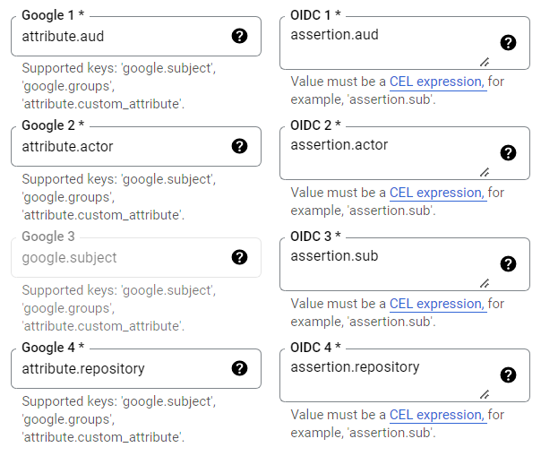

# Description

The backend server of this project.

# Usage


# Deploy

## Automate by GitHub action

The solution in this part we use GitHub OIDC provider and Google Cloud IAM **Workload Identity Federation**.



### procedure

1. Create a service account at [**IAM Service accounts**](https://console.cloud.google.com/iam-admin/serviceaccounts).

2. Grant roles at [**IAM**](https://console.cloud.google.com/iam-admin/iam), who gives permission for access project
	 resources _(Remember enable **APIs** when grant roles)_:
	  - App Engine Admin
    - Cloud Build Editor
    - Cloud Scheduler Admin(Optional)
		-	Service Account User
		-	Storage Admin

    - ..._(Could just set rule to owner for development)_
3. Create a pool at [**Workload Identity Pools**](https://console.cloud.google.com/iam-admin/workload-identity-pools)

4. Create a provider at [**Workload Identity Pools**](https://console.cloud.google.com/iam-admin/workload-identity-pools)
	 add issuer: https://token.actions.githubusercontent.com and binding attribute mapping.
	 

5. Create GitHub action:

```yaml
jobs:
  deploy:

    runs-on: ubuntu-latest

    permissions:
      contents: 'read'
      id-token: 'write'

    steps:
    - uses: 'actions/checkout@v3'

    - id: 'auth'
      name: 'Authenticate to Google Cloud'
      uses: 'google-github-actions/auth@v1'
      with:
        workload_identity_provider: '${{ secrets.GCP_WORKLOAD_IDENTITY_PROVIDER }}'
        service_account: '${{ secrets.GCP_SERVICE_ACCOUNT }}'

    - id: 'deploy'
      name: 'Deploy code to App Engine'
      uses: 'google-github-actions/deploy-appengine@v1'
```

6. Binding auth secrets (data from [Setting](https://console.cloud.google.com/iam-admin/settings) &
	 [Workload Identity Pools](https://console.cloud.google.com/iam-admin/workload-identity-pools) &
	 [Account Detail -> key](https://console.cloud.google.com/iam-admin/serviceaccounts/details)):
```javascript
  GCP_WORKLOAD_IDENTITY_PROVIDER = `projects/${PROJECT_NUM}/locations/global/workloadIdentityPools/${POOL}/attribute.repository/awap-12/visualization-server`
  GCP_SERVICE_ACCOUNT = `${ACCOUNT}@${PROJECT_ID}.iam.gserviceaccount.com`
  GCP_PROJECT = PROJECT_ID
  GCP_SA_KEY = ACCOUNT_GENERATE_KEY
```
